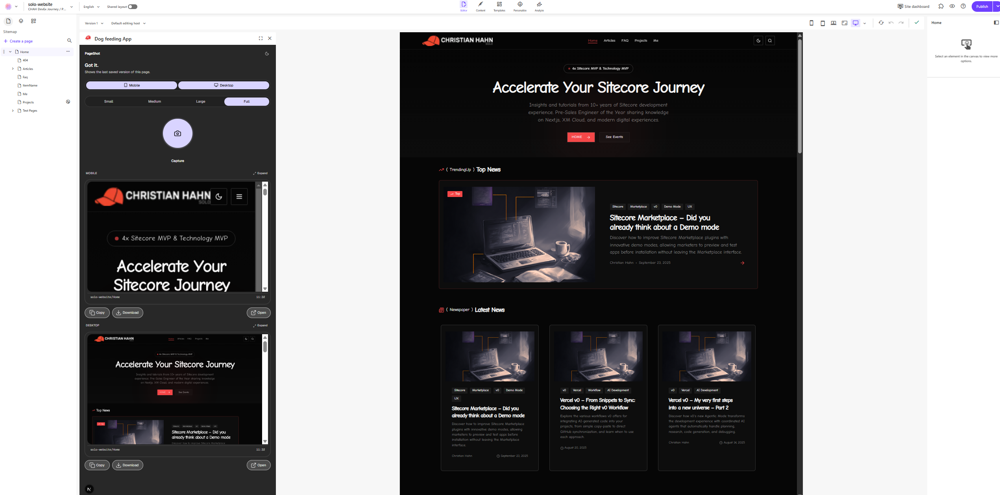

# PageShot

A Sitecore Marketplace custom app that adds a one-button "capture screenshot" control to the SitecoreAI Pages editor.



## What it does

Content editors working in SitecoreAI Pages often need to share the page they're working on with colleagues — in Slack, Teams, email, or a review thread. PageShot adds a Page Builder Context Panel inside the Pages editor with a single action: click Capture, get a clean chrome-free screenshot of the current page, then Copy it to clipboard, Download it as PNG, or Open it in a new tab. The image comes from the SitecoreAI Agent API's `/screenshot` endpoint, rendered server-side without the editor chrome that an OS screenshot tool would capture.

## Tech stack

- **Next.js 16** (App Router) on the **Node runtime** for the server-side route handler — [ADR-0004](./project-planning/ADR/adr-0004-nextjs-app-router-node-runtime.md)
- **React 19** + **TypeScript** (strict, with `noUncheckedIndexedAccess`)
- **Tailwind v4** (CSS-first `@theme inline` tokens in `app/globals.css`)
- **Blok** design system (Sitecore's shadcn-based primitives)
- **`@sitecore-marketplace-sdk/client`** for the `pages.context` subscription inside the iframe
- **SitecoreAI Agent API** for the screenshot endpoint, called via OAuth 2.0 client-credentials with a server-side token cache
- **Vitest** + **React Testing Library** + **jsdom** for unit and component tests
- **Vercel** hosting (HTTPS preview + production URLs registered as Marketplace extension URLs) — [ADR-0003](./project-planning/ADR/adr-0003-no-local-https-vercel-previews-as-integration-surface.md)

## Getting started

### Prerequisites

- **Node.js 20+** and npm
- A **SitecoreAI tenant** with an **Automation Client** created in Cloud Portal. Copy the `client_id` and `client_secret` — the secret is shown once.
- Organization Admin or Owner role on the target tenant (required to create the Automation Client).

### Install

```bash
cd site/next-app
npm install
```

### Environment

```bash
cp .env.example .env.local
# Then edit .env.local and fill in:
#   SITECORE_DEPLOY_CLIENT_ID
#   SITECORE_DEPLOY_CLIENT_SECRET
```

Both are **server-only** — no `NEXT_PUBLIC_` prefix. They are read exclusively by the Node route handler at `app/api/screenshot/[pageId]/route.ts` and the shared token cache in `lib/sitecore-token.ts`. The panel UI never reads them.

### Run

```bash
npm run dev        # dev server on http://localhost:3000
npm run build      # production build
npm run lint       # ESLint
npm run typecheck  # tsc --noEmit
npm run test       # Vitest (one-shot via `npm run test -- --run`)
```

The panel route is `/panel`. To exercise it inside a real Sitecore Pages editor, register the Vercel preview URL as a custom-app Page Builder Context Panel extension.

## Project structure

| Path | Purpose |
|---|---|
| `site/next-app/app/panel/` | Page Builder Context Panel route — renders `<PageshotPanel>` |
| `site/next-app/app/api/screenshot/[pageId]/` | Node-runtime proxy that calls the Agent API with server-side OAuth credentials |
| `site/next-app/components/` | Panel UI: shutter, polaroid card, action pills, toggles, theme switcher, live region |
| `site/next-app/lib/` | `sitecore-token.ts` (OAuth cache), `filename.ts` (PNG filename helper), `trim-image.ts` (auto-trim whitespace), `utils.ts` |
| `site/next-app/fixtures/` | Test fixtures for mocked Agent API responses, OAuth tokens, and the canonical `pages.context` event |
| `site/next-app/test-utils/` | Vitest helpers — `mockFetch`, `mockClipboard`, `mockMatchMedia`, `sdkStubs` |
| `project-planning/` | PRD, ADRs, task breakdown, runbooks, test reports — the build's planning history |
| `pocs/` | HTML clickdummies of the three UI-design proposals (Graphite Console, Shutterbug, Passepartout) |
| `docs/` | This documentation set — [architecture](./docs/architecture.md), [decisions](./docs/decisions.md) |

## Architecture summary

PageShot is a **client-side iframe Marketplace custom app** plus one **Next.js route handler** ([ADR-0002](./project-planning/ADR/adr-0002-client-iframe-with-server-proxy.md)). The panel UI runs in the browser inside the Sitecore Pages iframe and subscribes to `pages.context` via the Marketplace SDK. On capture, it calls its own `/api/screenshot/[pageId]` route. That route holds the OAuth `client_id` / `client_secret` server-side, fetches or reuses a cached JWT (24 h lifetime, 60 s safety margin, stampede-protected), calls the SitecoreAI Agent API's `/screenshot` endpoint, and returns the base64 PNG to the panel.

The panel decodes the PNG, auto-trims any trailing whitespace introduced by the Agent API's fixed-height rendering, and hands the result to the state machine. The editor picks up one or two captures (Mobile 375 px, Desktop 1200 px, or both) at one of four height presets (Small 800 → Full 8000 px) and sees them stacked as polaroid cards with per-capture Copy / Download / Open actions.

The app is **stateless** — no database, no persisted images ([ADR-0006](./project-planning/ADR/adr-0006-stateless-no-persistence.md)). It is registered as a **custom app** on a single tenant, not published to the public Marketplace in this release ([ADR-0005](./project-planning/ADR/adr-0005-custom-app-single-tenant.md)).

See [`docs/architecture.md`](./docs/architecture.md) for the full narrative and [`docs/decisions.md`](./docs/decisions.md) for the ADR index.

## Known constraints

- **Download pending host sandbox fix.** The Sitecore Pages iframe sandbox currently lacks `allow-downloads`, so the canonical `<a download>` click used by the Download action silently no-ops. Sitecore has committed to adding the sandbox token. In the meantime, use the **Open** action — it calls `window.open` to escape the sandbox to a real browser tab where the PNG renders and you can right-click → Save Image As. Once `allow-downloads` ships, Download will begin working with no code changes.
- **Agent API `height` is an exact dimension, not a full-page toggle.** Shorter pages render with solid-color padding at the bottom (the client auto-trims it); longer pages are cropped at the requested height. Use the Height picker (Small / Medium / Large / Full) to match your page length. A `fullPage=true` query param does not exist in the API.
- **Single-tenant custom app.** Not submitted to the public Marketplace. A second tenant would need its own automation client, Vercel environment variables, and custom-app registration.

## Links

- [CHANGELOG](./CHANGELOG.md)
- [Architecture](./docs/architecture.md)
- [Decisions](./docs/decisions.md)
- [Project planning](./project-planning/) — full build history (PRDs, ADRs, task breakdown, code review, test report)
